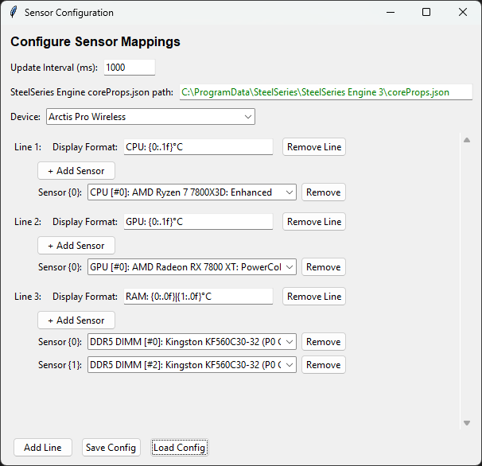
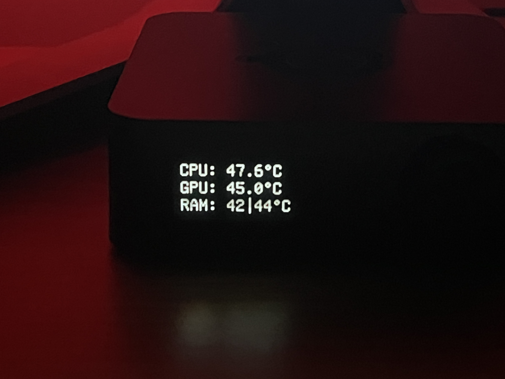

# SteelSeries Vitals Monitor

Display system information from HWiNFO64 on your SteelSeries device's screen.

> **Note:** This app was only tested with the Arctis Pro Wireless device. Other devices may work but are untested.

## Requirements

- **Windows** operating system
- **Python 3.6+** (3.8+ recommended)
- **HWiNFO64** with reporting to Gadget enabled
- **SteelSeries Engine**

## Installation

### 1. Install Prerequisites

**Python:**
- Download from [python.org](https://www.python.org/downloads/)
- During installation, check **"Add Python to PATH"**

**HWiNFO64:**
- Download from [hwinfo.com](https://www.hwinfo.com/download/)
- Enable reporting to Gadget: Sensor Settings (Configure Settings button) -> HWiNFO Gadget -> Enable reporting to Gadget"
- In the list, select which sensors you want to report to Gadget by selecting 'Report value in Gadget'

**SteelSeries Engine:**
- Download from [steelseries.com](https://steelseries.com/engine)

### 2. Install Python Dependencies

Open Command Prompt or PowerShell in the project directory and run:

```bash
pip install -r requirements.txt
```

Or if you have multiple Python versions:

```bash
python -m pip install -r requirements.txt
```

## Usage

### Configure Sensors

1. Ensure SteelSeries Engine is installed (required for coreProps.json file)
2. In HWiNFO64 note the sensor names you want to display
3. Run the configuration app via 'config_gui.pyw'
4. Select your device from the dropdown menu
5. Configure your display lines and save

### Run the Monitor

Simply double-click `monitor.pyw`.
The script runs in the background. Check `log.txt` for status messages.

## Configuration

The `sensor_config.json` file stores your configuration with display format strings and HWiNFO64 sensor registry keys.

## Example

Here's an example configuration:



And the result displayed on the device:



## Troubleshooting

- **"Configuration file not found"**: Run `config_gui.pyw` first
- **"Unable to retrieve GameSense address"**: Ensure SteelSeries Engine is running
- **No display**: Verify HWiNFO64 is running with shared memory enabled
- Check `log.txt` for detailed error messages

## Support

If you experience any issues or you just want to ask me anything about the app, please contact me on Discord: **volevoyy**

### Advanced Users

If the app doesn't work for your device, you can modify the code yourself using the [SteelSeries GameSense SDK documentation](https://github.com/SteelSeries/gamesense-sdk) to adapt it for your specific device.
